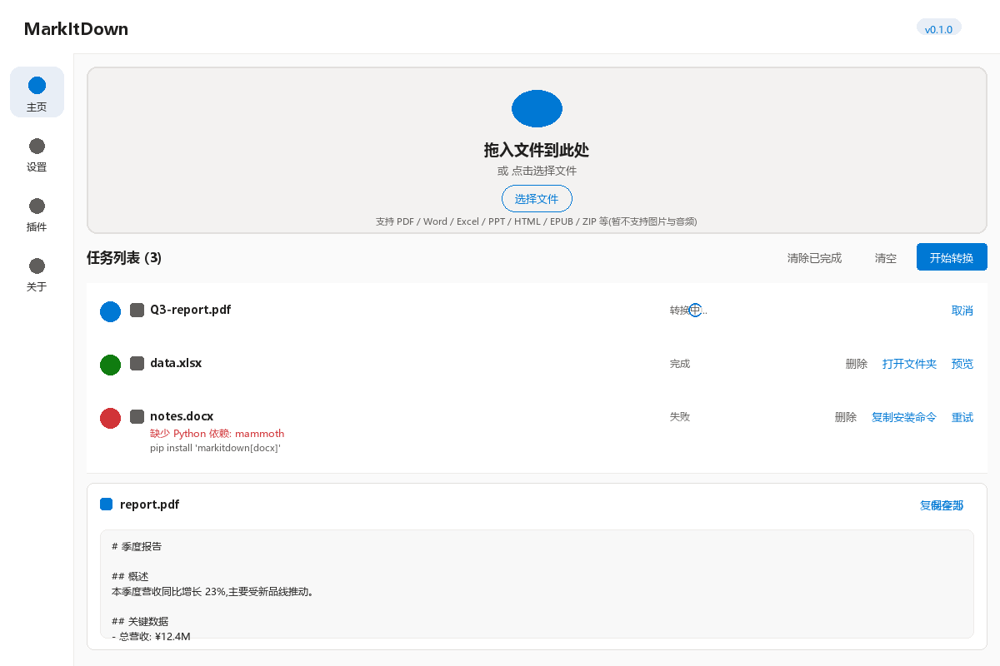

# MarkItDown GUI

> **桌面端图形界面,基于 [microsoft/markitdown](https://github.com/microsoft/markitdown) 构建。**
> 原始命令行版本的所有能力均保留,新增 Material 3 风格的桌面应用,让非技术朋友也能轻松使用。

[](LICENSE)
[](https://www.python.org/)
[](https://flet.dev/)

---

## 📖 关于本项目

本项目是 [microsoft/markitdown](https://github.com/microsoft/markitdown) 的**派生版本**。原始仓库的全部代码与功能均原样保留在 `packages/markitdown/`,我们在此基础上**新增了 `packages/markitdown-gui/` 桌面端应用**。

| 来自原始 markitdown(保留,零修改) | 本项目新增 |
|---|---|
| 核心 Python 转换库 `markitdown` | 🆕 桌面 GUI 包装 `markitdown-gui` |
| 命令行 `markitdown <file>` | 🆕 拖放 + 任务队列 + Markdown 预览 |
| 18 种文件格式支持 | 🆕 任务列表 + 进度 + 单条重试/删除 |
| Azure Document Intelligence 集成 | 🆕 设置页统一管理 API 密钥 + 测试连接 |
| Azure Content Understanding 集成 | 🆕 同样的设置页支持 |
| 3rd-party 插件系统 | 🆕 插件页可视化启/禁 |

> **核心转换逻辑零修改**;GUI 是独立的 Python 包,直接 `import markitdown` 复用,完全不侵入主代码。

## ✨ 功能特性

- 🎨 **Material 3 现代 UI** — Flet 框架,跨平台桌面
- 📂 **拖放 + 选择文件** — 一次拖多个,自动去重
- ⚡ **并发转换** — 后台线程池,并行处理 2 个文件
- 📋 **Markdown 预览** — 转换完直接看,支持复制 / 另存为
- 💾 **输出管理** — 自定义输出目录,一键打开文件夹
- 🔌 **云端集成**(可选) — Azure Document Intelligence / Content Understanding / LLM 视觉描述
- 🧩 **插件管理** — 可视化启/禁 3rd-party 插件
- 🔐 **密钥安全** — API key 存 OS 钥匙串(Win Credential Manager / macOS Keychain)
- 🚦 **友好错误提示** — 缺依赖、转换失败、空结果都有具体原因 + 解决建议
- 🪟 **跨平台** — Windows 10/11 / macOS 12+

## 📸 截图



> 主页:拖放区 + 任务列表(运行中 / 完成 / 失败) + Markdown 预览面板。
> 设置、插件、关于页通过左侧导航栏访问。

## 📦 仓库结构

```
markitdown/                              # 本仓库(派生自 microsoft/markitdown)
├── packages/
│   ├── markitdown/                      # 原始核心库(零修改)
│   ├── markitdown-mcp/                  # 原始 MCP server(零修改)
│   ├── markitdown-ocr/                  # 原始 OCR 插件(零修改)
│   ├── markitdown-sample-plugin/        # 原始示例插件(零修改)
│   └── markitdown-gui/                  # 🆕 新增:桌面端 GUI
│       ├── src/markitdown_gui/          # 应用源码
│       ├── tests/                       # 单元测试
│       └── scripts/                     # dev / build 脚本
├── Dockerfile                           # 原始 Docker(零修改)
├── LICENSE                              # MIT(继承自原始)
├── README.md                            # 本文件
└── ...
```

## 🚀 快速开始

### 选项 A:用预编译版本(推荐,给朋友用)

从 [Releases](https://github.com/&lt;你的用户名&gt;/markitdown-gui/releases) 下载对应平台:
- **Windows**: `MarkItDown.exe`
- **macOS**: `MarkItDown.app`

双击运行,无需安装 Python 环境。

### 选项 B:开发模式(自己改代码用)

需要 Python ≥ 3.10。

```sh
# 1) 克隆本仓库
git clone https://github.com/<你的用户名>/markitdown-gui.git
cd markitdown-gui

# 2) 启动 GUI(脚本会自动装兄弟包 + 当前包 + dev extras)
cd packages/markitdown-gui
scripts\dev_run.bat          # Windows
./scripts/dev_run.sh         # macOS / Linux
```

第一次运行会:
1. 把 `markitdown[all]` 装到当前 venv(从 `../markitdown` 本地源)
2. 把 `markitdown-gui` 装到 venv(可编辑模式 + dev extras)
3. 启动 Flet 桌面应用

### 选项 C:打包发布(自己分发给朋友)

```sh
cd packages/markitdown-gui
scripts\build_windows.bat    # 产出 dist\MarkItDown\MarkItDown.exe
./scripts/build_macos.sh     # 产出 dist/MarkItDown.app
```

打包前需要:
- `assets/icon.png` (256×256 PNG) — Windows
- `assets/icon.icns` — macOS(可用 `iconutil` 从 `.iconset` 生成)

## 📖 使用流程

1. **启动应用** — 出现 Material 3 风格的窗口
2. **拖入文件**(或点「选择文件」) — 文件进入任务列表
3. **点「开始转换」** — 后台线程池并发处理
4. **完成后点「预览」** — 在底部面板看 markdown
5. **复制 / 另存为 / 打开文件夹** — 三选一

### 配置云端服务(可选)

1. 侧边栏点「设置」
2. 填入 LLM / Doc Intel / CU 的 endpoint + API key + model
3. 点「测试连接」验证配置
4. 点「保存」 — API key 自动存到 OS 钥匙串

> 不配置云端服务也能用,只是 PDF/Word/Excel/PPT 等纯本地转换照常工作。

### 启用 3rd-party 插件

1. `pip install markitdown-xxx`(具体插件看 [markitdown 文档](https://github.com/microsoft/markitdown#plugins))
2. 重启 GUI
3. 侧边栏点「插件」 — 看到新插件出现
4. 切换「启用」开关

## ⚠️ 当前不支持的文件类型

- 🖼 **图片**(.jpg / .jpeg / .png)— 需要 exiftool + LLM 才能产生有意义的输出
- 🎵 **音频**(.wav / .mp3 / .m4a)— 需要 ffmpeg + SpeechRecognition(网络依赖)
- 🎬 **视频**(.mp4) — 同上

> 拖入或选择这些文件会被自动跳过,并在底部弹 snackbar 提示。

如果未来需要支持,优先级是:
- v1.1: 增加设置页里的"系统工具检测 + 引导安装"模块
- v2.0: 在工具链齐全的前提下重新启用

## 🧪 运行测试

```sh
cd packages/markitdown-gui
pip install -e ".[dev]"
pytest
```

测试覆盖:
- `test_paths_service.py` — 用户数据目录
- `test_settings_service.py` — 配置读写、keyring CRUD、`build_markitdown()`
- `test_flet_api_compat.py` — 静态检查所有 `ft.Colors.*` / `ft.Icons.*` / `ft.XControl(kwarg=...)` 在已安装 Flet 中有效

## 🗺 路线图

- ✅ **v1.0**(当前): 18 种文本类型转换 + 云端集成 + 插件管理
- 🚧 **v1.1**: 加密 fallback 的用户密码 prompt、拖放体验优化、暗色主题切换、批量输出目录配置
- 💭 **v2.0**: 重新考虑图片/音频(更好的工具链前提下)、自动更新机制

## 🙏 致谢

本项目是站在巨人的肩膀上:

- **[microsoft/markitdown](https://github.com/microsoft/markitdown)** — 核心转换库,本项目的所有转换能力来自这里
- **[Flet](https://flet.dev)** — 跨平台桌面 UI 框架,Python + Flutter
- **[magika](https://github.com/google/magika)** — 文件类型检测
- **[keyring](https://github.com/jaraco/keyring)** — OS 钥匙串抽象
- **[platformdirs](https://github.com/platformdirs/platformdirs)** — 用户数据目录
- 所有 3rd-party 插件作者

## 📄 许可

**MIT License**,继承自 [microsoft/markitdown](https://github.com/microsoft/markitdown) 主仓库。详见 [LICENSE](LICENSE)。
